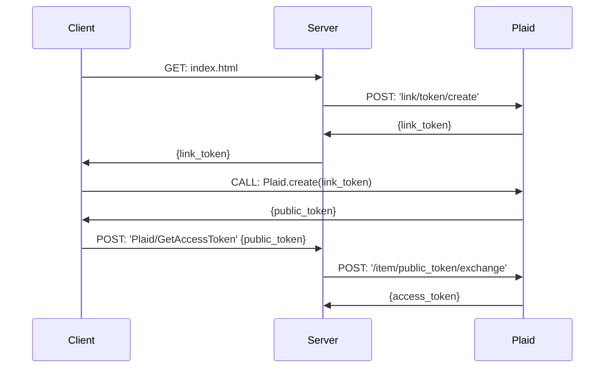

# How access token is acquired

```mermaid
sequenceDiagram
	participant c as Client
	participant s as Server
	participant p  as Plaid
	
	c ->> s: GET: index.html
	s ->> p: POST: 'link/token/create'
	p ->> s: {link_token}  
	s ->> c: {link_token}
	c ->> p: CALL: Plaid.create(link_token)
	p ->> c: {public_token}
	c ->> s: POST: 'Plaid/GetAccessToken' {public_token}
	s ->> p: POST: '/item/public_token/exchange'
	p ->> s: {access_token}
	
```